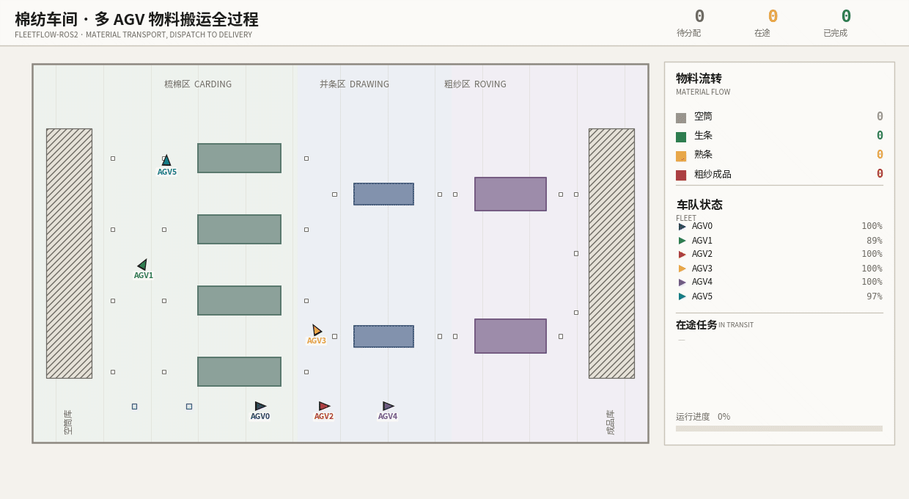
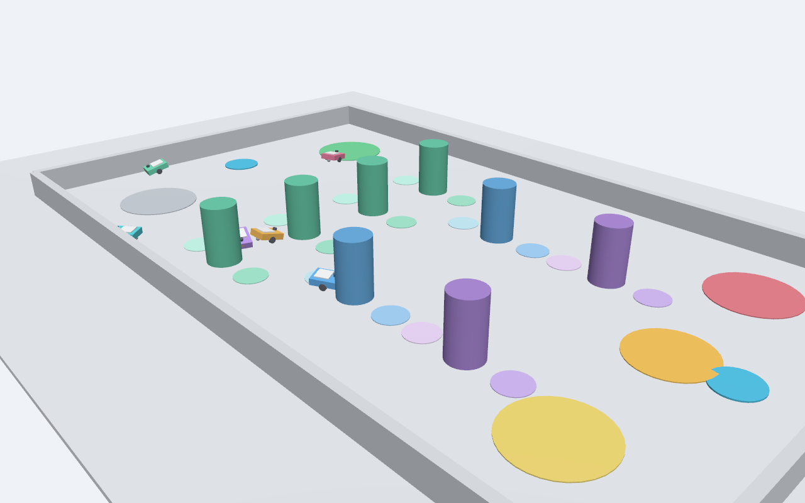
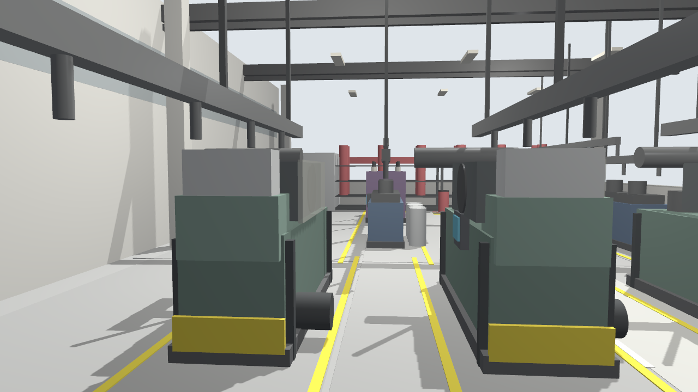
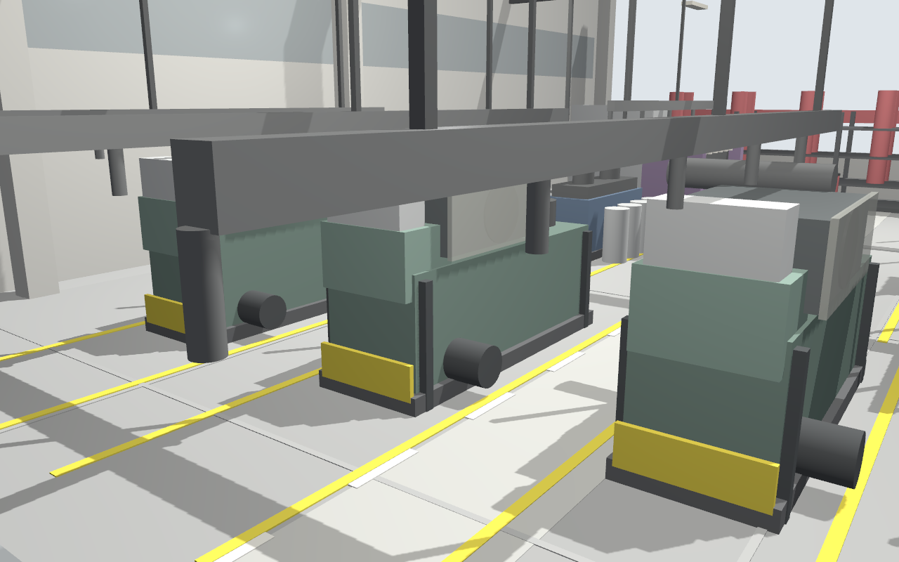
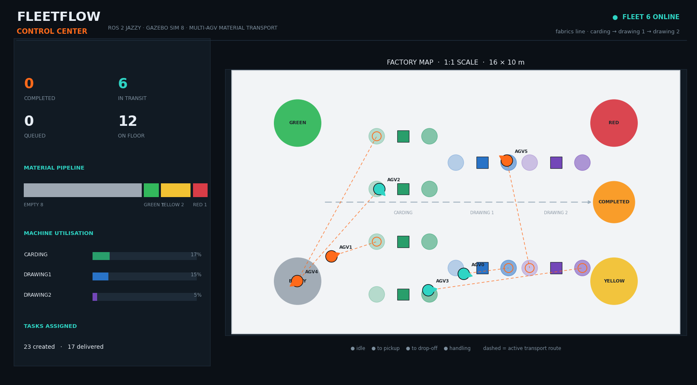
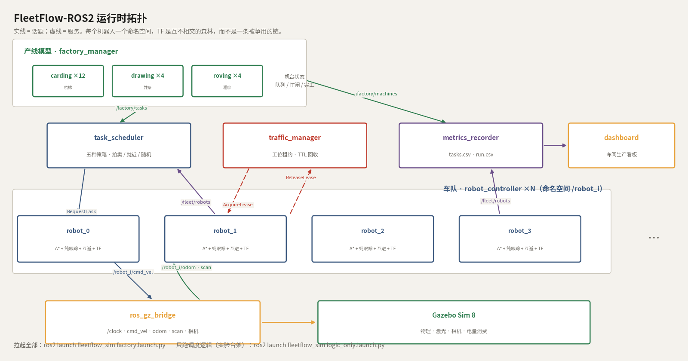
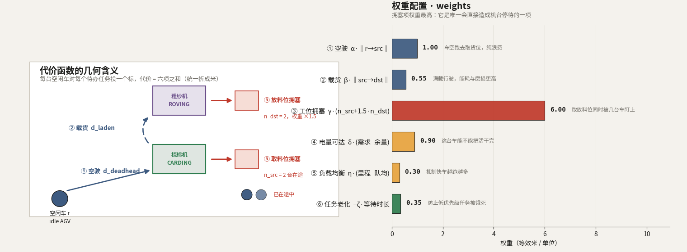
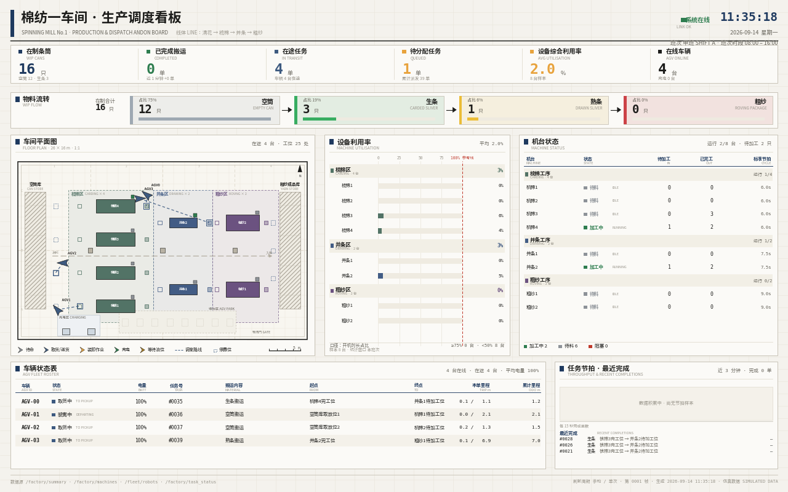
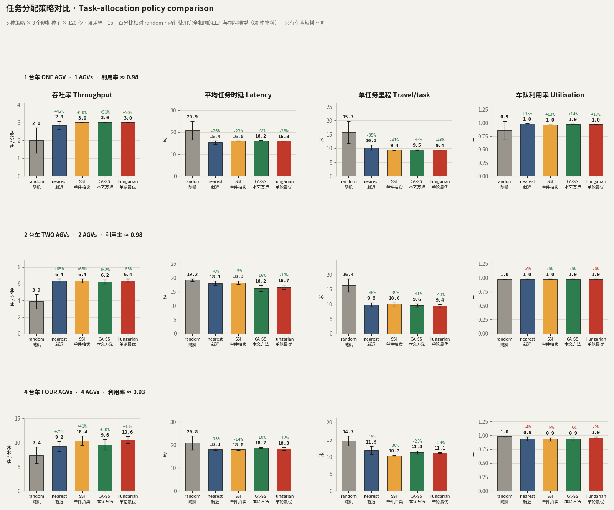
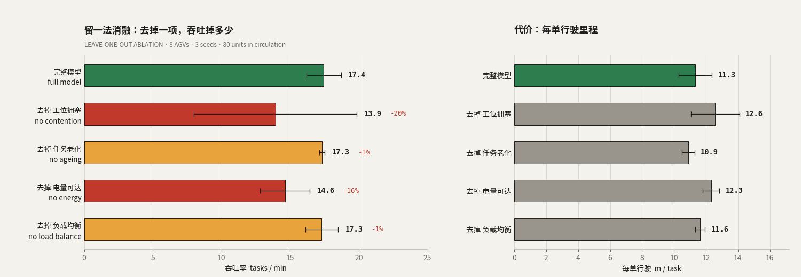

<div align="center">

# FleetFlow-ROS2

**纺织厂多 AGV 物料搬运仿真**

<sub>ROS 2 Jazzy · Gazebo Sim 8 · 每车独立命名空间与 TF · 租约式停靠 · CA-SSI 分配</sub>

[](https://docs.ros.org/en/jazzy/)
[](https://gazebosim.org/)
[](#快速开始)
[](#快速开始)

[快速开始](#快速开始) &nbsp;•&nbsp; [车队](#车队) &nbsp;•&nbsp; [分配](#分配) &nbsp;•&nbsp; [结果](#结果) &nbsp;•&nbsp; [消融](#消融) &nbsp;•&nbsp; [稳定性](#稳定性)

*[English](README.md) &nbsp;|&nbsp; 简体中文*

</div>



*一个完整循环，从发放任务到送达。实线=已行驶，虚线=剩余规划；通道里的托盘是 A\* 代价图里的真实静态障碍。*

5 台 AGV 在 26 × 16 米的车间里，于梳棉、并条、粗纱机台之间搬运条筒。调度器派单，
每台车自己规划并执行路径，生产看板显示车间状态。

| | |
|---|---|
| **分配** —— 8 台车、同一座工厂 | CA-SSI **18.7** 件/分 · SSI 15.2 · random 10.6 |
| **改进前 → 改进后** | 吞吐 **+23 %** · 单任务里程 **−16 %** · 近距事件 **−53 %** |
| **谁在扛代价模型** | 工位拥塞（去掉 **−20 %**）· 电量可达（去掉 **−16 %**） |
| **单轮最优** | `hungarian` 从不获胜 —— 14.9 对 18.7 |
| **已验证** | 协同栈，墙钟 · **Gazebo 物理尚未** —— 见[稳定性](#稳定性) |

---

## 快速开始

```bash
mkdir -p ~/ros2_ws/src && cd ~/ros2_ws/src
git clone https://github.com/p20030920p/FleetFlow-ROS2.git
cd ~/ros2_ws && colcon build --symlink-install && source install/setup.bash

ros2 launch fleetflow_sim factory.launch.py                  # 只起 Gazebo 服务端
ros2 launch fleetflow_sim factory.launch.py gui:=true        # 带 Gazebo 界面
ros2 launch fleetflow_sim logic_only.launch.py num_robots:=8 policy:=ssi   # 不启 Gazebo

# Gazebo 界面 + 浏览器里的实时平面图，并排对照
ros2 launch fleetflow_sim factory.launch.py gui:=true web:=true num_robots:=4
# 打开 http://127.0.0.1:8080 —— 画面走 /stream 与 /map/stream（MJPEG 流）
```

两边读的是同一批话题，所以并排放就能最快地确认平面图里的坐标、朝向、任务流向和三维场景是否一致。
页面走 MJPEG 流；**点一下切到铺满全屏的平面图**（`Esc` 或再点一下返回），
也可以直接取 `/map.png` 拿那一帧静图。`web_port` / `web_size` / `web_every`
可覆盖端口、分辨率与刷新间隔。单独运行：`ros2 run fleetflow_sim live_view`。

网页里那张图和截图是同一个渲染器现场重画，所以是 **4–6 fps**（总览 250 ms、平面图 150 ms 一帧）——
这是 matplotlib 的上限，不是某个设置的问题。本页顶部那段动图是 12.5 fps，因为它是**离线渲染**的：
先录一次运行，再慢慢画，不必跟着仿真跑；那条流水线见[复现](#复现)。

`gui:=false`（默认）只起**一个**带 `--headless-rendering` 的服务端；`gui:=true` 只起**一个**界面。
两者绝不同时起 —— 同时起两个服务端，就会出现"窗口开了但什么都不渲染"。如果上一次是被强杀而不是
Ctrl-C，它的服务端会变成孤儿进程，下一次开界面可能连到它上面：`bash tools/gz_reset.sh` 可以清掉。

相机话题**默认不桥接**。桥接的 `sensor_msgs/Image` 一旦订阅端跟不上，缓冲会无限增长 ——
实测约 5 GB RSS，足以触发 OOM killer。相机是 `always_on=0`（有订阅才渲染），且一次只桥一路：

```bash
ros2 launch fleetflow_sim factory.launch.py bridge_cameras:=true
ros2 run ros_gz_bridge parameter_bridge "/view_iso/image@sensor_msgs/msg/Image@gz.msgs.Image" &
python3 tools/capture_views.py /tmp/shots /view_iso/image && kill %1
```

---

## 车队

世界由 [`tools/build_world.py`](tools/build_world.py) 生成：527 个模型 —— 机弄、条筒货架、
架空巡回清洁轨道、通道托盘、地面警示标线。



*3/4 剖视：机弄、条筒货架、架空巡回清洁轨道。*

<p align="center">
  
  
  
</p>

*俯视 · 沿产线 · 机台近景。*



*与动图同一个渲染器 —— 既能出静图也能定时出帧，两者不会走样。*



*factory_manager → task_scheduler → 带命名空间的 robot_controller → Gazebo，租约服务横跨其间。*

| 关注点 | 实现 |
|---|---|
| 命名空间 / TF | 每台车一个命名空间与一个 `robot_state_publisher`；TF 是森林，不是一条被争用的链。 |
| 停靠 | 基于租约，带 TTL 回收。每台车最多持一个租约，不会"抱着一个去抢另一个"，等待发生在开阔地面 —— 不存在 *hold-and-wait*，也就没有循环等待。 |
| 避障 | 互让 + 确定性优先级；每次 A\* 前把同伴注入动态障碍层；独立的 LiDAR 急停。 |
| 电量 | 按里程耗电；低于阈值停止投标，用同一套租约排队充电。 |
| 派单 | 拉取式：车辆只在空闲时要任务，从机制上消除双重分配竞态。 |

---

## 分配

运输指派是多机器人任务分配问题。只认空驶距离在棉纺车间里是错的：机台只有**一个**对接位、
电量是**硬**约束、此刻最便宜的车不等于一个班次里最便宜的车队。

| 策略 | 代价 |
|---|---|
| `random` | 无 —— 下界 |
| `nearest` | 取自己最近的任务，仅局部 |
| `ssi` | 以空驶距离为代价的顺序单件拍卖 |
| **`ca_ssi`** | **同一套拍卖，六项工业代价** |
| `hungarian` | 对该代价矩阵求线性分配最优 |



*权重单位是等效米，渲染时从 `policies.py` 读取。*

```
J = α‖p_r − s_t‖ + β‖s_t − g_t‖ + γ(n_src + 1.5 n_dst)
  + δ·max(0, e_need + reserve − e_r) + η(d_r − d̄)/d_max − ζ·min(age, 20) + 0.02·prio
```

绕开一个被占用的对接位，等价于多开 `γ/α = 6` 米。老化项必须封顶；不封顶它会压过其余所有项，
拍卖退化成 FIFO。

---

## 结果

> **车队规模是设计参数，不是目标。** 同一座厂、24 件物料，4 台车跑 6 次 300 秒 —— 差距本身就是结论：

| 车队 | 每次 300 秒完成运输 | 次/分钟 | 轮廓相交 |
|---:|---|---:|---:|
| **4 台**（推荐） | 16 · 10 · 13 · 14 · 22 · 18 | 1.8–5.5 | 0 |
| 8 台 | 4 · 7 · 9 | 0.7–1.7 | 0 · 0 · 2 |

> **8 台车的产出只有 4 台车的一半。** 让路次数从个位数涨到 42~87 次，
> 说明 8 台车不是更忙，而是**大部分时间在互相让路**。这个厂 26 × 16 m、
> 通道净宽 1.45 m，而两台车会车需要 1.04 m，余量太薄：车越多，
> 会车成本涨得越快，很快吃掉新增运力。**4 台是当前布局的经济车数。**
>
> **口径说明**：上表数的是**运输操作**（每一次把料从 A 送到 B），不是成品数。
> 一件成品要经过 5 次以上运输，所以成品数比它低一个量级 —— 逻辑模式下实测约 0.6 件/分钟，
> 而机器仍有 **76~100% 的时间在等料**。成品数请读工厂的 `done`（日志里每 10 秒一行）。
>
> 这一轮的进展在**根因**上：Gazebo 侧 `/robot_i/odom` 的 QoS 不兼容
> （桥接发布 RELIABLE、控制器订阅 BEST_EFFORT，DDS 下一条都收不到），
> 使控制器与协调层**一直以为车停在出生点**。修好之后 4 台车产量翻倍、
> 假卡死从 96~232 次降到 0、轮廓相交降到 0。
>
> 仍未解决的是**方差**：同样的命令、同样的时长，产量仍会在 2 倍范围内波动。
> 完整证据与失败的尝试：[docs/gazebo-throughput-findings.md](docs/gazebo-throughput-findings.md)。

**产线的时间到底丢在哪。** 现在有五个独立测量指向同一处：车队规模无关（8 台 ≈ 4 台）、
取放位数量无关、在途上限调大反而更差、单次运输只要 22 s，可是一次运行只完成
16~41 次运输，却要打 194~361 次脱困、最长卡死 88~210 s ——
**花在"把车从彼此之间弄出来"上的时间远多于花在运料上**。于是机器
**饿 76~100%、堵 0%**：不是吃饱了，是根本没料送到。

根因是 1.45 m 通道净宽对 1.04 m 会车需求 —— 就是第 36~42 节在避让层里追的同一个缺陷。
车队、调度、脱困规则各调了一轮，四次都是负面结果，所以下一步要改的是**通道**而不是规则：
加宽、增设待避湾（让让路的车有地方可去）、或改成单向环线。本轮实测"把让路车按在原地"
会让卡死恶化一倍 —— **光靠避让规则变不出通行能力**。



*Gazebo 实时看板 —— `web:=true` 后打开 `http://127.0.0.1:8080`，画面走 `/stream` 与 `/map/stream`。*

5 策略 × 3 种子 × 120 秒，在制 80 件物料，工厂完全相同 —— 只有车队规模不同。

> **这组数字的状态。** 它们是在协调层与控制器统一碰撞判据**之前**测的，
> 当前代码下无法复现（80 物料、8 台车、`ca_ssi` 实测只有 6~8 件/分，而非 18.7）。
> 表格保留作为历史记录，在重跑之前请视为**未经验证**。
> 详见 [docs/gazebo-throughput-findings.md](docs/gazebo-throughput-findings.md)。



*误差棒 1σ；百分比相对 `random`。*

| 策略 | 3 台 件/分 | 3 台 米/单 | 8 台 件/分 | 8 台 米/单 | 8 台 近距事件 |
|---|---:|---:|---:|---:|---:|
| random | 9.0 | 12.2 | 10.6 | 13.8 | 6.7 |
| nearest | 10.4 | 9.8 | 12.3 | 11.7 | 4.3 |
| ssi | 10.0 | 10.1 | 15.2 | 12.9 | 6.3 |
| **ca_ssi** | **10.7** | **9.1** | **18.7** | **10.8** | **3.0** |
| hungarian | 9.9 | 10.4 | 14.9 | 11.9 | 6.5 |

**改进前 → 改进后。** 同一份代码，只改了 `ca_ssi_cost`。

| 指标 | 车队 | SSI | CA-SSI | 变化 | 相对 `random` |
|---|---|---:|---:|---:|---:|
| 吞吐 | 3 台 | 10.0 | 10.7 | **+7 %** | +18 % |
| 吞吐 | 8 台 | 15.2 | 18.7 | **+23 %** | +77 % |
| 每单里程 | 3 台 | 10.1 | 9.1 | **−10 %** | −25 % |
| 每单里程 | 8 台 | 12.9 | 10.8 | **−16 %** | −22 % |
| 近距事件 | 8 台 | 6.3 | 3.0 | **−53 %** | −55 % |

优势随竞争强度增长：3 台车很少争同一个单泊位工位，8 台车是常态。`hungarian` 优化一张静态矩阵，
看不见拥塞、电量与排队 —— 最优的分配方案不等于最优的系统。在制物料只有 28 件时工厂"缺料饿死"，
所有策略收敛到约 16 件/分钟，用什么规则根本测不出来。

---

## 消融

六项代价逐项置零；同一套拍卖、同一组种子、同一座工厂。



*8 台车、3 种子、80 件物料。*

| 代价模型 | 件/分 | 相对完整 | 米/单 |
|---|---:|---:|---:|
| **CA-SSI（六项齐全）** | **17.45** | — | **11.3** |
| − 工位拥塞（γ） | 13.92 | **−20 %** | 12.6 |
| − 电量可达（δ） | 14.63 | **−16 %** | 12.3 |
| − 负载均衡（η） | 17.29 | −1 % | 11.6 |
| − 任务老化（ζ） | 17.32 | −1 % | 10.9 |

真正扛事的是两项。负载均衡与任务老化在这个工况下是**零结果** —— 120 秒太短攒不出里程优势，
而防饿死项的职责是兜住最坏情况、不是抬高平均值。两项都保留，但都不声称在这组实验里回了本。

---

## 稳定性

| 机制 | 作用 |
|---|---|
| 租约 + TTL | 一个工位一个持有者；不存在 hold-and-wait；持有者失联后回收。 |
| 看门狗 | 10 秒无位移 → 重规划；第二次 → 低速爬行；第三次 → 放弃并重新入队。 |
| 靠泊模式 | 距目标 0.8 m 内急停阈值降到 0.12 m —— 急停距离永远不能大于到达判定。 |
| 车体轮廓屏蔽 | 逐角度把回波与车体自身轮廓比较；否则两个前角正好落在 0.24 m 的急停扇区里。 |
| 按需重规划 | 只在同伴占住前方 2.2 m 路径时才重算 —— 定时重算会打断转弯，车在原地来回摆。 |
| 碰撞判据 | 用**有向矩形**互相做分离轴测试，而不是车心距。见下。 |

4 台 AGV、300 秒墙钟、6 次 Gazebo 运行、全开关：**运输操作 16 · 10 · 13 · 14 · 22 · 18 次，
轮廓相交 0、假卡死 0、无崩溃。** 同一命令下产量仍有两倍上下的波动 —— 这一句才是实话。

**为什么"车心距"是错的判据。** 车体 0.56 × 0.44 m：并排需要 0.44 m 车心距、首尾需要 0.56 m、
任意朝向都不重叠需要 0.712 m。代码里写的是 0.34 m，而且**只在前方 ±52° 锥形里生效** ——
等于主动把车开到必然重叠的距离，同时完全不管侧后方来车。Gazebo 如实暴露：1900 次重叠、最近 0.259 m。
现在改为两个有向矩形之间的**分离轴测试**。

**这一轮找到两个根因，两个都无法从日志表面看出来。**

其一：`/robot_i/odom` 的 QoS 不兼容。桥接发布 RELIABLE、控制器订阅 BEST_EFFORT，
在 DDS 下这一对**一条都送不到** —— 不是丢帧，是彻底收不到。于是驱动之上的每一层
都在拿"出生点"当车的真实位姿推理，而由位姿差分算出的速度恒为 0，协调层因此判定
**全队永久停车**，一次运行里触发 96~232 次假卡死。修完之后 4 台车产量翻倍、假卡死归零。

其二：协调层判断"车是不是停着"用的是**最后一条指令速度**。车停下就不再收到指令，
这个字段于是冻在停车前的值，一台 `idle` 的车照样上报 0.85 m/s。等待判定、
反饥饿优先级、让路裁决在车队真正堵住时**全是死代码**。

**限制 Gazebo 的有一半不是车队。** 空筒取放位只有 4 个，所以最多并发 4 单，
之后每有一件推进一个工序才腾出空位放进新料。一次运行结束时的看板截图显示
16 件里有 12 件还躺在库里。所以"单/分钟"混合了三件事：喂料并发、工厂内部节拍
（约 8 件/分钟，由中间工序决定）与运输。车队规模的横向比较仍然有效（各臂同受供给限制），
但**绝对产量不能当作车队能力的度量**。

**予以撤回。** 本节早先写着"Gazebo 不是可用的吞吐演示环境"以及"底盘复现不了指令运动"。
两条都错了。指令 0.6 m/s 持续 8 秒实走 4.085 m（原生）/ 3.952 m（经 ROS），
达到理想的 85% / 82%，就是正常的加速与收敛；真正的故障是上面那两个。
本页顶部那段动图早于这些修复，其中车辆的通过距离在物理下是不允许的。


---

## 复现

```bash
# 三组实验
python3 tools/run_experiments.py --policies random nearest ssi ca_ssi hungarian \
    --seeds 1 2 3 --seconds 120 --robots 3 --drain 0.10 --out experiments/saturated \
    --extra max_tasks_in_flight:=18 num_materials:=80
python3 tools/run_experiments.py --policies random nearest ssi ca_ssi hungarian \
    --seeds 1 2 3 --seconds 120 --robots 8 --drain 0.10 --out experiments/slack \
    --extra max_tasks_in_flight:=18 num_materials:=80
python3 tools/run_experiments.py \
    --policies ca_ssi ca_nocong ca_noener ca_nobal ca_noage \
    --seeds 1 2 3 --seconds 120 --robots 8 --drain 0.10 --out experiments/ablation \
    --extra max_tasks_in_flight:=18 num_materials:=80

# 出图
python3 tools/plot_results.py experiments/saturated/summary.csv \
    experiments/slack/summary.csv assets/readme/policy-comparison.png
python3 tools/plot_ablation.py experiments/ablation/summary.csv assets/readme/ablation.png
python3 tools/plot_cost_model.py assets/readme/cost-model.png
python3 tools/plot_architecture.py assets/readme/architecture.png

# 动图分两步：先录一次运行，再离屏重画
ros2 launch fleetflow_sim logic_only.launch.py num_robots:=6 policy:=ca_ssi
python3 tools/record_run.py /tmp/run.jsonl --fps 10 --seconds 95 --min-robots 6
python3 tools/render_demo.py /tmp/run.jsonl assets/readme/demo.gif --speed 6
```

| 指标 | 定义 |
|---|---|
| makespan | 最后一次送达 − 第一次派单 |
| 吞吐 | 每分钟完成任务数 |
| 时延 | 送达 − 生成，均值 / p50 / p95 |
| 利用率 | 处于"行驶或装卸"的时间占比 |
| 近距事件 | 任意两车距离小于 0.55 m 的上升沿次数 |

---

## 接口

| 接口 | 类型 | |
|---|---|---|
| `/factory/tasks` | `TransportTask` | 新任务，周期性重播 |
| `/factory/task_status` | `TransportTask` | 派发、完成、失败 |
| `/factory/machines` | `MachineState` | 状态、位置、进出料数、忙闲比 |
| `/fleet/robots` | `RobotStatus` | 位姿、状态、电量、当前任务 |
| `/scheduler/request_task` | srv | 车辆拉取下一个任务 |
| `/traffic/acquire`, `/traffic/release` | srv | 工位与充电桩租约 |
| `/robot_N/path` | `nav_msgs/Path` | 剩余规划路径 |

## 目录结构

```text
FleetFlow-ROS2/
├── src/fleetflow_interfaces/       # 消息与服务定义
├── src/fleetflow_sim/
│   ├── fleetflow_sim/              # layout · planner · factory_manager
│   │                               # task_scheduler · traffic_manager
│   │                               # robot_controller · policies · dashboard · live_view
│   ├── worlds/textile_factory.sdf  # 由脚本生成
│   ├── urdf/agv.urdf.xacro
│   └── launch/
├── tools/                          # build_world · run_experiments · record_run
│                                   # render_demo · plot_* · capture_views
└── experiments/                    # 原始 CSV：saturated/ slack/ ablation/
```

## 边界

- `ca_ssi` 给"它看得见的"拥塞定价，看不见"下一次派单会造成的"拥塞；一次只派一单，不规划多单路线。
- 拉取式派单是刻意的：push 模型必须维护每台车的忙碌状态，一次完成通知丢失就会让那台车永久"忙碌"。
- 电量参数调成"一次短运行内能观察到充电"，是行为演示，不是能耗研究。
