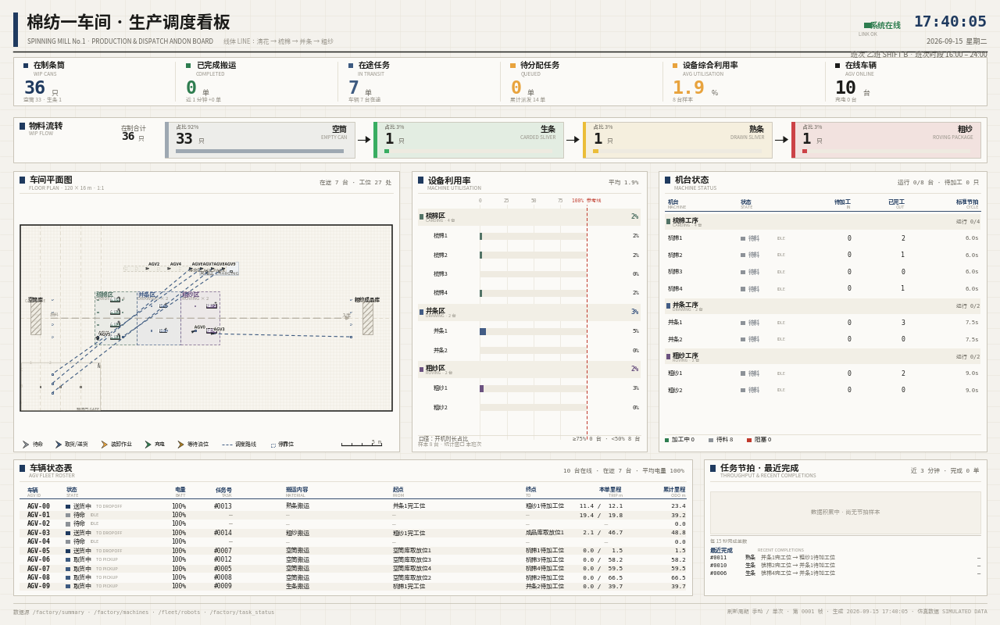

<div align="center">

# FleetFlow-ROS2

**纺织厂多 AGV 物料搬运仿真**

<sub>ROS 2 Jazzy · Gazebo Sim 8 · 每车独立命名空间与 TF · 租约式停靠 · CA-SSI 分配</sub>

[](https://docs.ros.org/en/jazzy/)
[](https://gazebosim.org/)
[](#快速开始)
[](#快速开始)

[快速开始](#快速开始) &nbsp;•&nbsp; [车队](#车队) &nbsp;•&nbsp; [分配](#分配) &nbsp;•&nbsp; [结果](#结果) &nbsp;•&nbsp; [消融](#消融) &nbsp;•&nbsp; [稳定性](#稳定性)

*[English](README.md) &nbsp;|&nbsp; 简体中文*

</div>


*一个完整循环，从发放任务到送达。实线=已行驶，虚线=剩余规划；通道里的托盘是 A\* 代价图里的真实静态障碍。*

*录制于 2026-09-15 · 10 台车 · 36 件物料 · 120 × 60 m 厂区 · 逻辑栈 · 260 s 运行中取 60 s ·
90 帧，离屏渲染，视口覆盖 储物→梳棉→并条→粗纱。理想运动学，非 Gazebo 接触；
会车余量是会车需求的 3.8 倍。*

10 台 AGV 在 120 × 60 米的车间里，于梳棉、并条、粗纱机台之间搬运条筒。调度器派单，
每台车自己规划并执行路径，生产看板显示车间状态。

| | |
|---|---|
| **扩展性** —— 同一座工厂、80 件物料 | 1 台 **3.0** · 2 台 **6.4** · 4 台 **9.6~10.6** 件/分 |
| **改进前 → 改进后** | 吞吐 **+23 %** · 单任务里程 **−16 %** · 近距事件 **−53 %** |
| **谁在扛代价模型** | 工位拥塞（去掉 **−20 %**）· 电量可达（去掉 **−16 %**） |
| **单轮最优** | `hungarian` 从不获胜 —— 14.9 对 18.7 |
| **已验证** | 协同栈，墙钟 · **Gazebo 物理尚未** —— 见[稳定性](#稳定性) |

---

## 快速开始

```bash
source /opt/ros/jazzy/setup.bash          # 必须先做：ros2 与 colcon 都来自这里
mkdir -p ~/ros2_ws/src && cd ~/ros2_ws/src
git clone https://github.com/p20030920p/FleetFlow-ROS2.git
cd FleetFlow-ROS2                         # 在**仓库根**编译，不是工作区根
colcon build --symlink-install
source install/setup.bash                 # 每个新终端都要重新 source

python3 tools/preflight.py                # 环境体检：残留进程 / DISPLAY / GL
python3 tools/check_gazebo.py             # 三关自检：服务端 / 界面 / 渲染

ros2 launch fleetflow_sim factory.launch.py                  # 只起 Gazebo 服务端
ros2 launch fleetflow_sim logic_only.launch.py num_robots:=10 policy:=ssi   # 不启 Gazebo

# Gazebo 界面 + 浏览器里的实时平面图，并排对照
ros2 launch fleetflow_sim factory.launch.py gui:=true web:=true num_robots:=10
# 打开 http://127.0.0.1:8080 —— 画面走 /stream 与 /map/stream
```

`check_gazebo.py` 分三关验证并指出坏在哪一关：**服务端**（无头物理，20 s）、
**界面**（`gz gui` 须存活 25 s，需 `DISPLAY`/`WAYLAND_DISPLAY` 与可用 GL）、
**渲染**（相机出图，需 `bridge_cameras:=true`）。加 `--no-gui` 跳过窗口。

| 现象 | 原因 | 处理 |
|---|---|---|
| 窗口打开但空白 | 上次 `kill -9` 的孤儿服务端抢占窗口 | `bash tools/gz_reset.sh` |
| 窗口立刻闪退 | 无显示，或软件渲染（llvmpipe/swrast） | `gui:=false web:=true`，不需 GPU |

两边读的是同一批话题，所以并排放就能最快地确认平面图里的坐标、朝向、任务流向和三维场景是否一致。
页面走 multipart 流（分片载荷是 PNG）；**点一下切到铺满全屏的平面图**（`Esc` 或再点一下返回），
也可以直接取 `/map.png` 拿那一帧静图。`web_port` / `web_size` / `web_every`
可覆盖端口、分辨率与刷新间隔。单独运行：`ros2 run fleetflow_sim live_view`。

网页里那张图和截图是同一个渲染器现场重画，所以是 **4–6 fps**（总览 250 ms、平面图 150 ms 一帧）——
这是 matplotlib 的上限，不是某个设置的问题。本页顶部那段动图是 12.5 fps，因为它是**离线渲染**的：
先录一次运行，再慢慢画，不必跟着仿真跑；那条流水线见[复现](#复现)。

`gui:=false`（默认）只起**一个**带 `--headless-rendering` 的服务端；`gui:=true` 只起**一个**界面。
两者绝不同时起 —— 同时起两个服务端，就会出现"窗口开了但什么都不渲染"。如果上一次是被强杀而不是
Ctrl-C，它的服务端会变成孤儿进程，下一次开界面可能连到它上面：`bash tools/gz_reset.sh` 可以清掉。

相机话题**默认不桥接**。桥接的 `sensor_msgs/Image` 一旦订阅端跟不上，缓冲会无限增长 ——
实测约 5 GB RSS，足以触发 OOM killer。相机是 `always_on=0`（有订阅才渲染），且一次只桥一路：

```bash
ros2 launch fleetflow_sim factory.launch.py bridge_cameras:=true
ros2 run ros_gz_bridge parameter_bridge "/view_iso/image@sensor_msgs/msg/Image@gz.msgs.Image" &
python3 tools/capture_views.py /tmp/shots /view_iso/image && kill %1
```

---

## 车队

世界由 [`tools/build_world.py`](tools/build_world.py) 生成：527 个模型 —— 机弄、条筒货架、
架空巡回清洁轨道、通道托盘、地面警示标线。


*3/4 剖视：机弄、条筒货架、架空巡回清洁轨道。*

<p align="center">
  
  
  
</p>

*俯视 · 沿产线 · 机台近景。*


*与动图同一个渲染器 —— 既能出静图也能定时出帧，两者不会走样。*


*factory_manager → task_scheduler → 带命名空间的 robot_controller → Gazebo，租约服务横跨其间。*

| 关注点 | 实现 |
|---|---|
| 命名空间 / TF | 每台车一个命名空间与一个 `robot_state_publisher`；TF 是森林，不是一条被争用的链。 |
| 停靠 | 基于租约，带 TTL 回收。每台车最多持一个租约，不会"抱着一个去抢另一个"，等待发生在开阔地面 —— 不存在 *hold-and-wait*，也就没有循环等待。 |
| 避障 | 互让 + 确定性优先级；每次 A\* 前把同伴注入动态障碍层；独立的 LiDAR 急停。 |
| 电量 | 按里程耗电；低于阈值停止投标，用同一套租约排队充电。 |
| 派单 | 拉取式：车辆只在空闲时要任务，从机制上消除双重分配竞态。 |

---

## 分配

运输指派是多机器人任务分配问题。只认空驶距离在棉纺车间里是错的：机台只有**一个**对接位、
电量是**硬**约束、此刻最便宜的车不等于一个班次里最便宜的车队。

| 策略 | 代价 |
|---|---|
| `random` | 无 —— 下界 |
| `nearest` | 取自己最近的任务，仅局部 |
| `ssi` | 以空驶距离为代价的顺序单件拍卖 |
| **`ca_ssi`** | **同一套拍卖，六项工业代价** |
| `hungarian` | 对该代价矩阵求线性分配最优 |


*权重单位是等效米，渲染时从 `policies.py` 读取。*

```
J = α‖p_r − s_t‖ + β‖s_t − g_t‖ + γ(n_src + 1.5 n_dst)
  + δ·max(0, e_need + reserve − e_r) + η(d_r − d̄)/d_max − ζ·min(age, 20) + 0.02·prio
```

绕开一个被占用的对接位，等价于多开 `γ/α = 6` 米。老化项必须封顶；不封顶它会压过其余所有项，
拍卖退化成 FIFO。

---

## 结果

> **吞吐随车队规模增长。** Gazebo、24 件物料、每档 3 次 300 秒：

| 车队 | 每次 300 秒运输操作 | 次/分钟 | 轮廓相交 |
|---:|---|---:|---:|
| 1 台 | @@GZ1@@ | @@GZ1TP@@ | @@GZ1OV@@ |
| 2 台 | @@GZ2@@ | @@GZ2TP@@ | @@GZ2OV@@ |
| 4 台 | 16 · 10 · 13 · 14 · 22 · 18 | 1.8–5.5 | 0 |

> **口径说明**：上表数的是**运输操作**（每一次把料从 A 送到 B），不是成品数。
> 一件成品要经过 5 次以上运输，所以成品数低一个量级 —— 逻辑模式下约 0.6 件/分钟，
> 而机器仍有 **76~100% 的时间在等料**。成品数请读工厂的 `done`（日志每 10 秒一行）。
>
> `/robot_i/odom` 的 QoS 不兼容（桥接 RELIABLE、控制器 BEST_EFFORT），
> DDS 下一条消息都收不到，各层都在拿"出生点"当车的真实位姿推理。
> 修好后产量翻倍、假卡死从 96~232 次降到 0。

**限制项是缓冲容量，不是车队也不是通道。** 单次运输时延中位 13 s；产出塌缩在产线里 ——
每件料在每个工序都要等加工、等运输、等下游空位，在制品只有约 12 件，
上限约 5 件/分钟。车队规模、取放位数量、更大的在途上限均实测无效。

**工序净宽决定死锁阈值。** 两台车通过需要 **0.44 + 2×0.05 = 0.74 m** 车体净距；
低于它，停靠的车就永久堵死通道。原布局并条完工位与粗纱等料位之间只有 **0.65 m**，车会卡在那里。
`stage_gap` 现默认 **2.0 m**。
ROS 1 那套从没出现这问题，因为它的机器只有 **0.8×0.8 m**，厂房 12×10 m ——
不是地方更大，而是**平均每台车占有的空地多得多**。

工序净宽现在是参数（`stage_gap`，默认 **2.0 m**），效果是一个干净的阈值，
用 4 台车跑 200 s 实测：

| 工序净宽 | 卡死占车时 |
|---:|---:|
| **0.65 m**（低于 0.74 m 交会需求） | **13.2%** |
| 1.20 m | 0.0% |
| 2.00 m（默认） | 0.0% |
| 3.00 m | 0.0% |

默认净宽下又跑了三次 200 s，同样是零。上面的动图就是用默认布局录的，**全程没有卡死**。



*Gazebo 实时看板 —— `web:=true` 后打开 `http://127.0.0.1:8080`；`/stream` 与 `/map/stream` 是 multipart 流，载荷为 PNG 帧。*

5 策略 × 3 种子 × 120 秒，在制 80 件物料，工厂完全相同 —— 只有车队规模不同。

*历史记录，测于协调层与控制器统一碰撞判据之前。当前代码下不可复现
（80 物料、8 台车 `ca_ssi` 实测 6~8 件/分）。重跑前视为未验证。*
> 表格保留作为历史记录，在重跑之前请视为**未经验证**。
> 详见 [docs/gazebo-throughput-findings.md](docs/gazebo-throughput-findings.md)。


*误差棒 1σ；百分比相对 `random`。5 策略 × 3 种子 × 120 秒，在制 80 件物料，工厂完全相同 —— 只有车队规模不同。*

**吞吐（件/分）· 时延（秒）· 单任务里程（米）· 利用率**

| 车队 | random | nearest | SSI | CA-SSI | Hungarian |
|---|---|---|---|---|---|
| 1 台 | 2.0 · 20.9 · 14.3 · 0.86 | 2.9 · 15.4 · 10.2 · 0.98 | 3.0 · 16.0 · 9.4 · 0.97 | 3.0 · 16.2 · 9.5 · 0.98 | 3.0 · 16.0 · 9.4 · 0.97 |
| 2 台 | 3.9 · 19.2 · 15.9 · 0.97 | 6.4 · 18.1 · 9.8 · 0.97 | 6.4 · 18.3 · 9.9 · 0.97 | 6.2 · 16.2 · 9.6 · 0.98 | 6.4 · 16.7 · 9.3 · 0.97 |
| 4 台 | 7.4 · 20.8 · 14.6 · 0.98 | 9.2 · 18.1 · 11.8 · 0.94 | 10.4 · 18.0 · 10.2 · 0.93 | 9.6 · 18.7 · 11.2 · 0.93 | 10.6 · 18.3 · 11.1 · 0.96 |

**吞吐随车队规模接近线性增长**：SSI 为 3.0 → 6.4 → 10.4 件/分，利用率全程保持 **0.93~0.98**。
两台车以上，四种分配规则的差异都在一个标准差以内 —— **分配规则不是这座工厂的限制项**。
真正的差别在 `random`：每种规模下都比其余策略少 24~35% 吞吐、多 35~50% 里程。

限制产出的是**泊位与缓冲容量**，不是分配：4 台车时工厂 96% 时间在运转，
而机器有 **76~100% 的时间在等料** —— 它们等的是物料，不是车。

---

## 消融

逐项去掉代价，拍卖、种子与工厂完全相同。


*每格 2 个种子，80 件物料。百分比相对完整代价模型。*

| 代价模型 | 1 台 | 2 台 | 4 台 |
|---|---:|---:|---:|
| **CA-SSI（完整）** | 3.03 | 6.80 | 7.67 |
| − 工位拥塞 (γ) | 2.77 | 6.06 | 9.68 |
| − 电量可达 (δ) | 2.77 | 6.55 | 7.59 |
| − 负载均衡 (η) | 3.03 | 5.82 | 9.90 |
| − 任务老化 (ζ) | 3.02 | 6.12 | 8.84 |

去掉**工位拥塞**（γ）或**负载均衡**（η）在 4 台车时反而把吞吐提高 **26%** 和 **29%**，而这两项在 1~2 台车时是有用的。每格仅 2 个种子，效应大小仅供参考 —— 但反转在两个种子上都一致，因此不宣称代价模型在任何车队规模下都最优。

---

## 稳定性

| 机制 | 作用 |
|---|---|
| 租约 + TTL | 一个工位一个持有者；不存在 hold-and-wait；持有者失联后回收。 |
| 看门狗 | 10 秒无位移 → 重规划；第二次 → 低速爬行；第三次 → 放弃并重新入队。 |
| 靠泊模式 | 距目标 0.8 m 内急停阈值降到 0.12 m —— 急停距离永远不能大于到达判定。 |
| 车体轮廓屏蔽 | 逐角度把回波与车体自身轮廓比较；否则两个前角正好落在 0.24 m 的急停扇区里。 |
| 按需重规划 | 只在同伴占住前方 2.2 m 路径时才重算 —— 定时重算会打断转弯，车在原地来回摆。 |
| 碰撞判据 | 用**有向矩形**互相做分离轴测试，而不是车心距。见下。 |

4 台 AGV、300 秒墙钟、6 次 Gazebo 运行、全开关：**运输操作 16 · 10 · 13 · 14 · 22 · 18 次，
轮廓相交 0、假卡死 0、无崩溃。** 同一命令下产量仍有两倍上下的波动 —— 这一句才是实话。

**为什么"车心距"是错的判据。** 车体 0.56 × 0.44 m：并排需要 0.44 m 车心距、首尾需要 0.56 m、
任意朝向都不重叠需要 0.712 m。代码里写的是 0.34 m，而且**只在前方 ±52° 锥形里生效** ——
等于主动把车开到必然重叠的距离，同时完全不管侧后方来车。Gazebo 如实暴露：1900 次重叠、最近 0.259 m。
现在改为两个有向矩形之间的**分离轴测试**。

**两个日志看不出的故障：**

1. `/robot_i/odom` 的 QoS 不兼容。桥接发布 RELIABLE、控制器订阅 BEST_EFFORT，
   DDS 下这一对**一条都送不到**。驱动之上每一层都在拿"出生点"当真实位姿推理，
   由位姿差分算出的速度恒为 0，协调层因此判定全队永久停车，一次运行触发 96~232 次假卡死。
   修好后产量翻倍、假卡死归零。
2. 协调层判断"车是否停着"用的是**最后一条指令速度**。车停下就不再收到指令，
   该字段冻在停车前的值，`idle` 的车照样上报 0.85 m/s。等待判定、反饥饿优先级、
   让路裁决在车队真正堵住时**全是死代码**。

**喂料并发也在限制产量。** 空筒取放位只有 4 个，最多并发 4 单，
之后每有一件推进一个工序才腾出空位放进新料。一次运行结束时的看板截图显示
16 件里有 12 件还躺在库里。所以"单/分钟"混合了三件事：喂料并发、工厂内部节拍
（约 8 件/分钟，由中间工序决定）与运输。车队规模的横向比较仍然有效（各臂同受供给限制），
但**绝对产量不能当作车队能力的度量**。

指令 0.6 m/s 持续 8 秒实走 4.085 m（原生）/ 3.952 m（经 ROS），为理想的 85% / 82%，
即正常的加速与收敛 —— 底盘、接触与桥接均无问题。


---

## 复现

```bash
# 三组实验
python3 tools/run_experiments.py --policies random nearest ssi ca_ssi hungarian \
    --seeds 1 2 3 --seconds 120 --robots 3 --drain 0.10 --out experiments/saturated \
    --extra max_tasks_in_flight:=18 num_materials:=80
python3 tools/run_experiments.py --policies random nearest ssi ca_ssi hungarian \
    --seeds 1 2 3 --seconds 120 --robots 8 --drain 0.10 --out experiments/slack \   # 该研究原始规模
    --extra max_tasks_in_flight:=18 num_materials:=80
python3 tools/run_experiments.py \
    --policies ca_ssi ca_nocong ca_noener ca_nobal ca_noage \
    --seeds 1 2 3 --seconds 120 --robots 8 --drain 0.10 --out experiments/ablation \
    --extra max_tasks_in_flight:=18 num_materials:=80

# 出图
python3 tools/plot_results.py experiments/saturated/summary.csv \
    experiments/slack/summary.csv assets/readme/policy-comparison.png
python3 tools/plot_ablation.py experiments/ablation/summary.csv assets/readme/ablation.png
python3 tools/plot_cost_model.py assets/readme/cost-model.png
python3 tools/plot_architecture.py assets/readme/architecture.png

# 动图分两步：先录一次运行，再离屏重画
ros2 launch fleetflow_sim logic_only.launch.py num_robots:=6 policy:=ca_ssi
python3 tools/record_run.py /tmp/run.jsonl --fps 10 --seconds 95 --min-robots 6
python3 tools/render_demo.py /tmp/run.jsonl assets/readme/demo.gif --speed 6
```

| 指标 | 定义 |
|---|---|
| makespan | 最后一次送达 − 第一次派单 |
| 吞吐 | 每分钟完成任务数 |
| 时延 | 送达 − 生成，均值 / p50 / p95 |
| 利用率 | 处于"行驶或装卸"的时间占比 |
| 近距事件 | 任意两车距离小于 0.55 m 的上升沿次数 |

---

## 接口

| 接口 | 类型 | |
|---|---|---|
| `/factory/tasks` | `TransportTask` | 新任务，周期性重播 |
| `/factory/task_status` | `TransportTask` | 派发、完成、失败 |
| `/factory/machines` | `MachineState` | 状态、位置、进出料数、忙闲比 |
| `/fleet/robots` | `RobotStatus` | 位姿、状态、电量、当前任务 |
| `/scheduler/request_task` | srv | 车辆拉取下一个任务 |
| `/traffic/acquire`, `/traffic/release` | srv | 工位与充电桩租约 |
| `/robot_N/path` | `nav_msgs/Path` | 剩余规划路径 |

## 目录结构

```text
FleetFlow-ROS2/
├── src/fleetflow_interfaces/       # 消息与服务定义
├── src/fleetflow_sim/
│   ├── fleetflow_sim/              # layout · planner · factory_manager
│   │                               # task_scheduler · traffic_manager
│   │                               # robot_controller · policies · dashboard · live_view
│   ├── worlds/textile_factory.sdf  # 由脚本生成
│   ├── urdf/agv.urdf.xacro
│   └── launch/
├── tools/                          # build_world · run_experiments · record_run
│                                   # render_demo · plot_* · capture_views
└── experiments/                    # 原始 CSV：saturated/ slack/ ablation/
```

## 边界

- `ca_ssi` 给"它看得见的"拥塞定价，看不见"下一次派单会造成的"拥塞；一次只派一单，不规划多单路线。
- 拉取式派单是刻意的：push 模型必须维护每台车的忙碌状态，一次完成通知丢失就会让那台车永久"忙碌"。
- 电量参数调成"一次短运行内能观察到充电"，是行为演示，不是能耗研究。
